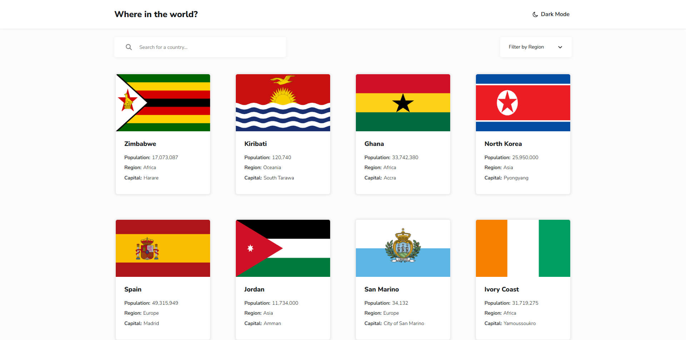

# Frontend Mentor - REST Countries API with color theme switcher solution

This is a solution to the [REST Countries API with color theme switcher challenge on Frontend Mentor](https://www.frontendmentor.io/challenges/rest-countries-api-with-color-theme-switcher-5cacc469fec04111f7b848ca). Frontend Mentor challenges help you improve your coding skills by building realistic projects.

## Table of contents

- [Overview](#overview)
  - [The challenge](#the-challenge)
  - [Screenshot](#screenshot)
  - [Links](#links)
- [My process](#my-process)
  - [Built with](#built-with)
  - [What I learned](#what-i-learned)
  - [Continued development](#continued-development)
  - [Useful resources](#useful-resources)
  - [AI Collaboration](#ai-collaboration)
- [Author](#author)

## Overview

### The challenge

Users should be able to:

- See all countries from the API on the homepage
- Search for a country using an `input` field
- Filter countries by region
- Click on a country to see more detailed information on a separate page
- Click through to the border countries on the detail page
- Toggle the color scheme between light and dark mode _(optional)_

### Screenshot

### Links

- Solution URL: [GitHub](https://github.com/ruslan898/frontend-mentor_rest-countries-api-with-color-theme-switcher/tree/main)
- Live Site URL: [Netlify](https://tranquil-conkies-0ab44e.netlify.app/)

## My process

### Built with

- Semantic HTML5 markup
- CSS custom properties
- Flexbox
- CSS Grid
- Mobile-first workflow
- [React](https://reactjs.org/) - JS library

### What I learned

While working through this project I've learned how to implement basic app routing using React Router and theme switching using CSS custom properties

### Continued development

I want to continue practicing creating more complex app routing in future projects

### Useful resources

- [SWR](https://www.npmjs.com/package/swr) - This npm package helped me with convenient data fetching and loading/error state management

### AI Collaboration

I've used ChatGPT for debugging and helping me integrate third-party npm packages into my project

## Author

- Frontend Mentor - [@ruslan898](https://www.frontendmentor.io/profile/ruslan898)
- GitHub - [@ruslan898](https://github.com/ruslan898)
